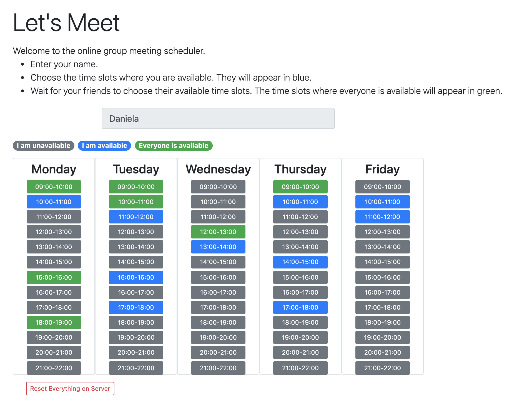

# Let's Meet - Backend server application

[Try it now!](https://maftuleac.com/letsmeet/)



## Description

An interactive web-application to help schedule a meeting where every participant is available.

The frontend client application shows a simple example of finding common overlaps of 1-hour time slots of all participants over five days from 9am to 9pm.

However, the algorithm works for more general problem, such as: 
given k participants each with n_k availability intervals of different lengths, find the common sub-intervals of all participants. 

### Starting the server
   ``` 
   node src/Server.js 
   ``` 
### Running the correctness tests  
   ``` 
   npm test  
   ```

## Architecture

* JavaScript 
* Node
* Express
* React and Reactstrap
* Mocha
    
## Design choices

The app consists of a client and server applications. 
The interactive client is written in JavaScript using React and Reactstrap.
The client app can be found [here](https://github.com/dmaftule/letsmeet-client).
The server is written using JavaScript Node and Express.

The algorithm computing the common overlapping intervals is written in JavaScript. 
The interval tree data structure is used for finding common availability intervals.
Tests for the correctness of the algorithm use Mocha JavaScript Test Framework.


